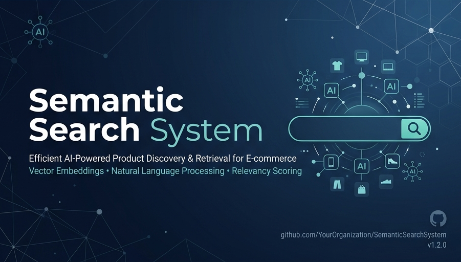
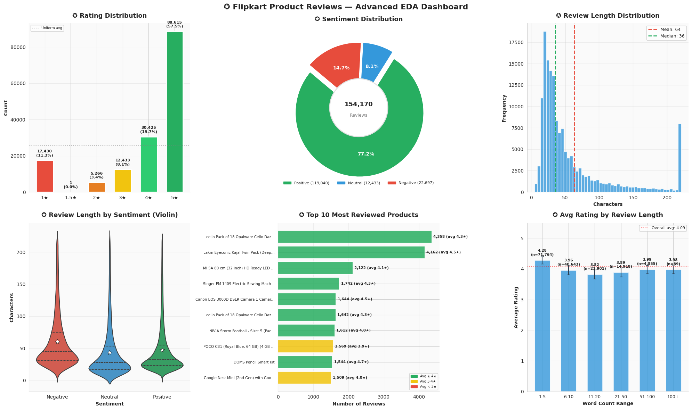
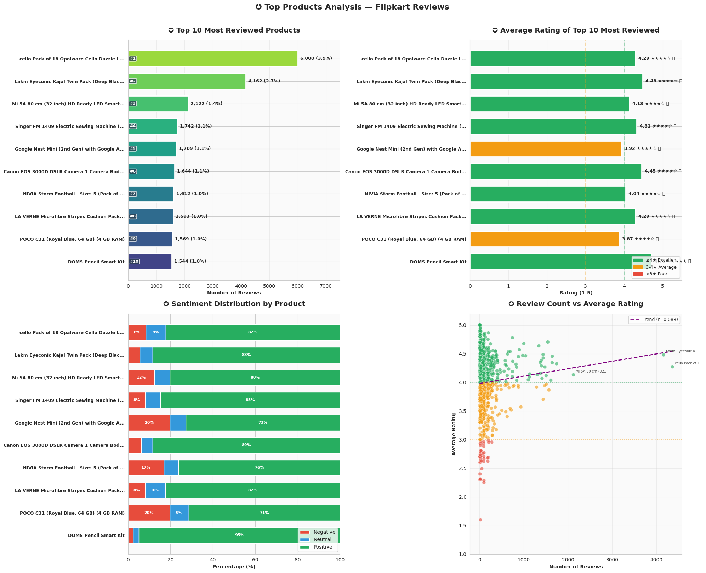
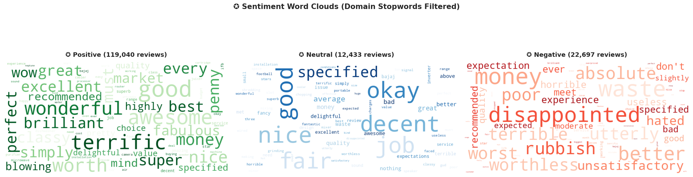
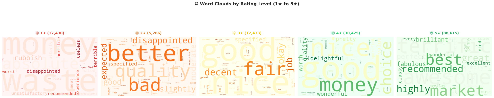
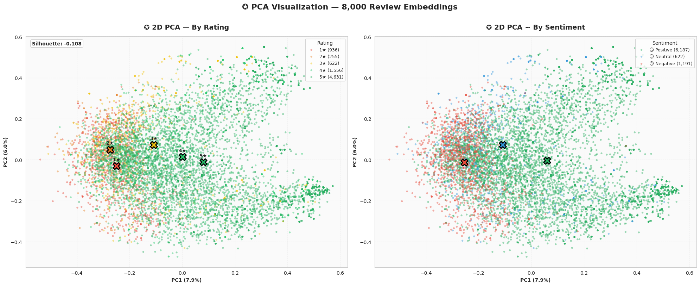
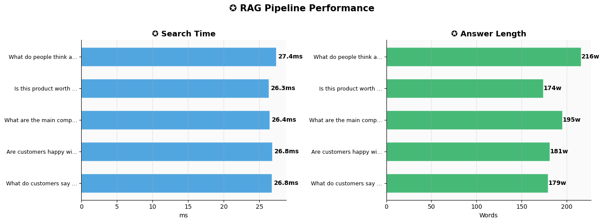

<div align="center">
  
</div>

<h1 align="center">🛒 Context-Aware Semantic Search for Flipkart Reviews</h1>

<p align="center">
  <a href="https://colab.research.google.com/drive/1JkNjYz4vSFck50ccEScJeVodCrEzVpCZ">
    
  </a>
  <a href="#">
    
  </a>
  <a href="#">
    
  </a>
</p>

## 💡 About The Project
Traditional keyword-based search engines often fail to capture the true *meaning* of a user's query. This project implements a robust **Semantic Search Engine** specifically tailored for e-commerce, using a real-world dataset of **Flipkart Product Reviews**. 

By leveraging state-of-the-art **Sentence Transformers**, the system converts text into high-dimensional vector embeddings. This allows it to understand context and retrieve the most relevant reviews based on meaning rather than exact word matches.

## 🚀 Key Highlights
- **Intelligent Discovery:** Matches complex, natural language queries (e.g., *"comfortable shoes for long runs"*) with the most relevant product reviews.
- **Advanced Embeddings:** Utilizes pre-trained NLP transformer models to generate dense vectors for both queries and review data.
- **Cosine Similarity:** Accurately ranks search results by calculating the mathematical distance between the query vector and review vectors.
- **End-to-End Pipeline:** Includes complete data preprocessing, exploratory data analysis (EDA), embedding generation, and search execution.

## 📊 Exploratory Data Analysis & Visualizations
Our analysis covers comprehensive EDA and embeddings visualization:

### 1. Data Distribution & Dashboards
<p align="center">
  
  
</p>

### 2. Text Analysis & Wordclouds
<p align="center">
  
  
</p>

### 3. Embeddings & Model Evaluation
<p align="center">
  
  
</p>

## 🛠️ Built With
* **Python** 
* **SentenceTransformers** (Hugging Face)
* **Pandas & NumPy** (Data Manipulation)
* **Scikit-Learn** (Similarity Computation)

## 💻 Getting Started

To run this project locally, follow these steps:

1. **Clone the repo**
   ```bash
   git clone https://github.com/m1n1v1rus/Semantic_Search_System___Flipkart_Reviews.git
   cd Semantic_Search_System___Flipkart_Reviews
   ```
2. **Install Dependencies**
   ```bash
   pip install sentence-transformers pandas scikit-learn numpy jupyter matplotlib seaborn
   ```
3. **Launch the Notebook**
   ```bash
   jupyter notebook Semantic_Search_System___Flipkart_Reviews.ipynb
   ```
   *Alternatively, you can run the project directly in your browser using the [Google Colab Link](https://colab.research.google.com/drive/1JkNjYz4vSFck50ccEScJeVodCrEzVpCZ) at the top of the page!*

## 🤝 Contributing
Contributions make the open source community such an amazing place to learn, inspire, and create. Any contributions you make are **greatly appreciated**.

## 📄 License
Distributed under the MIT License.
